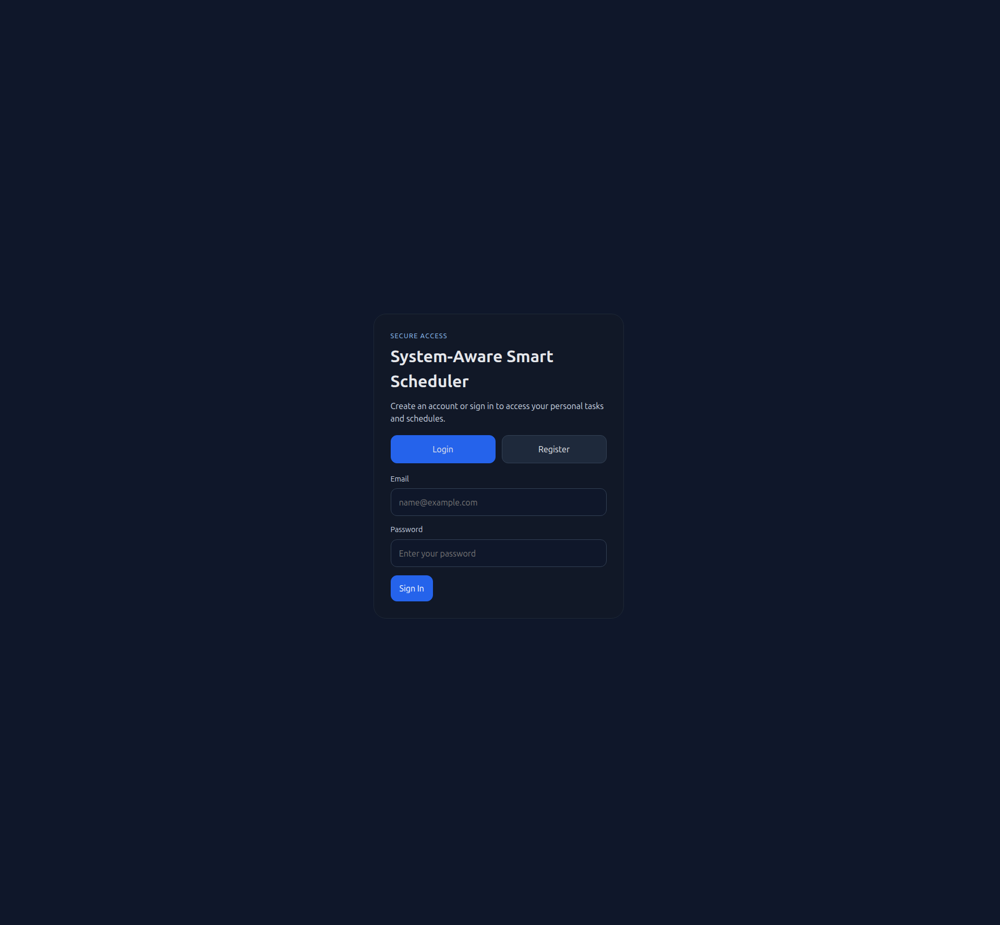
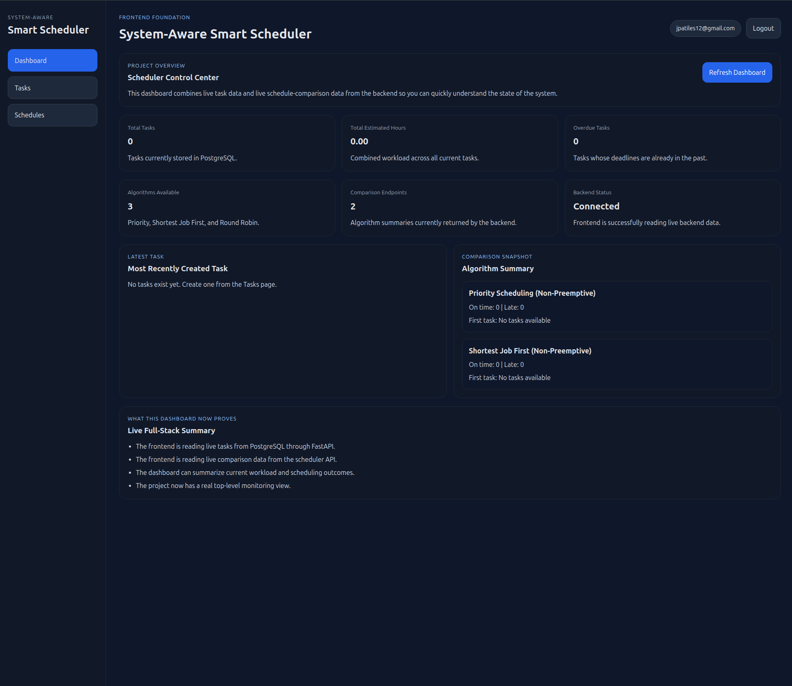
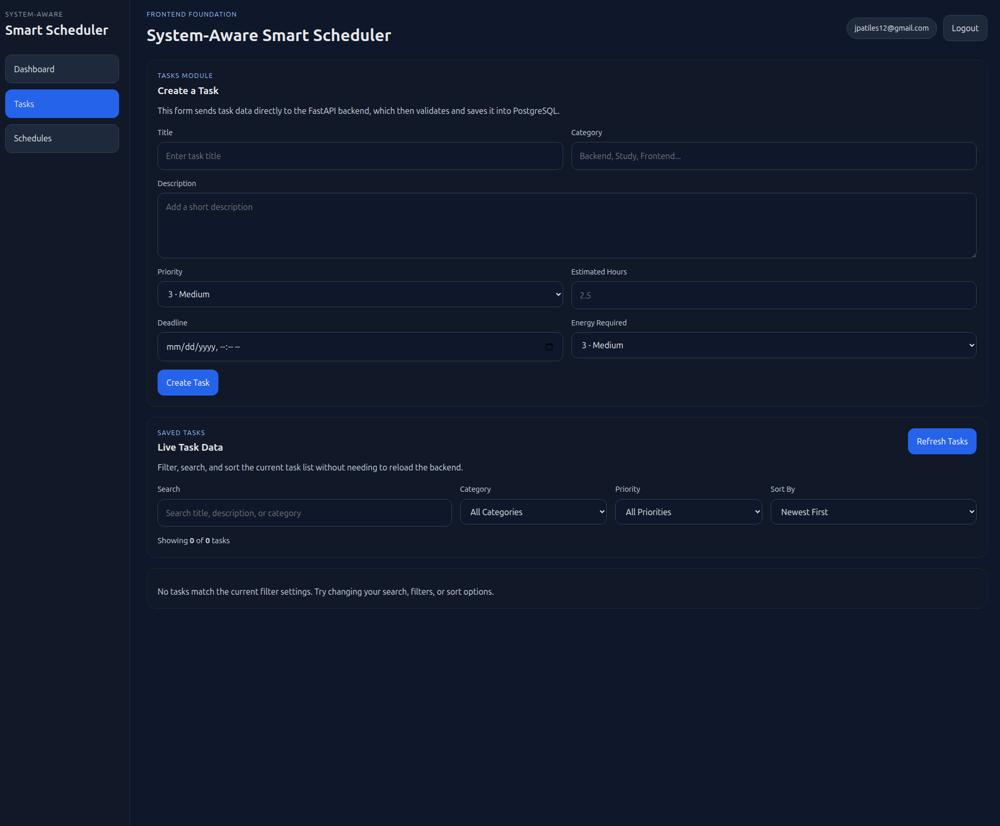
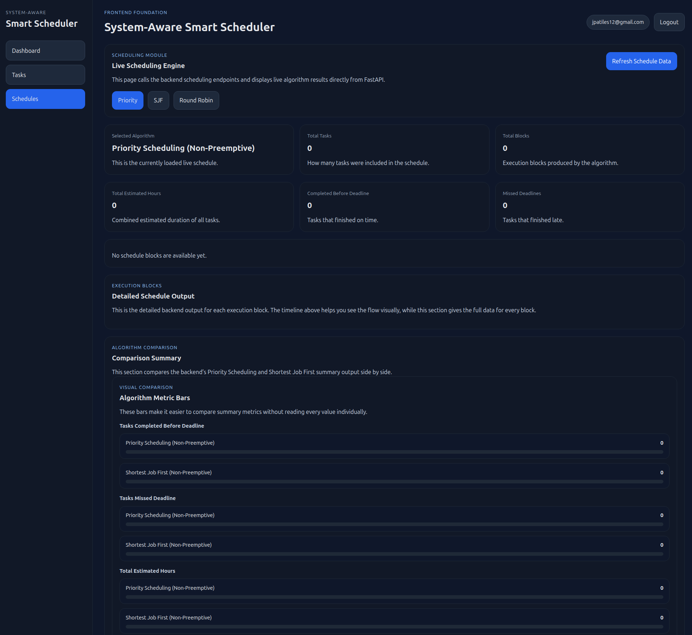
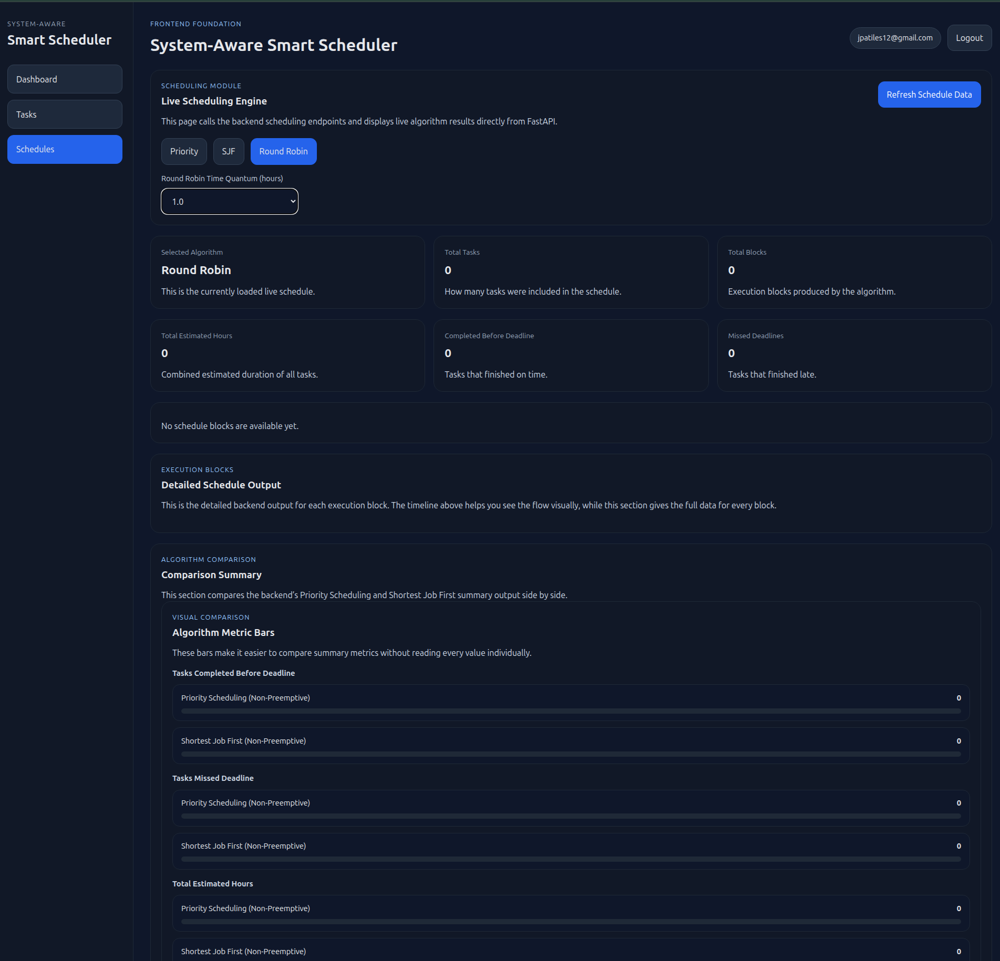

# System-Aware Smart Scheduler

A full-stack scheduling platform inspired by operating-system CPU scheduling concepts. This application allows users to create and manage tasks, generate schedules using multiple algorithms, compare scheduling strategies, and visualize execution blocks through a modern React frontend backed by FastAPI and PostgreSQL.

## Overview

System-Aware Smart Scheduler was built to go beyond a simple to-do app. Instead of only storing tasks, it applies scheduling strategies inspired by operating systems to determine execution order and evaluate outcomes.

The project supports:

- user authentication with JWT-based login
- task creation, editing, deletion, filtering, and sorting
- persistent PostgreSQL storage
- multiple scheduling algorithms
- live schedule comparison
- Dockerized full-stack setup

This project was designed to showcase full-stack engineering, backend architecture, database integration, and systems-oriented thinking.

---

## Key Features

### Authentication
- user registration
- user login with JWT access tokens
- session persistence in the frontend
- user-specific task ownership

### Task Management
- create tasks
- edit existing tasks
- delete tasks
- search by title, description, or category
- filter by category and priority
- sort by newest, deadline, priority, or estimated hours

### Scheduling Engine
- Priority Scheduling (Non-Preemptive)
- Shortest Job First (Non-Preemptive)
- Round Robin
- configurable Round Robin time quantum
- task execution block generation
- deadline completion metrics
- algorithm comparison summaries

### Dashboard and Visualization
- live dashboard summary
- schedule metrics
- visual execution timeline
- comparison metric bars
- algorithm-specific execution block display

### Infrastructure
- FastAPI backend
- PostgreSQL database
- React frontend with Vite
- Dockerized full stack using Docker Compose

---

## Scheduling Algorithms

### Priority Scheduling
Tasks are ordered by highest priority first. If two tasks share the same priority, earlier deadlines are used as a tie-breaker.

### Shortest Job First (SJF)
Tasks are ordered by smallest estimated duration first. This helps prioritize shorter jobs for faster completion.

### Round Robin
Tasks are executed in time slices using a configurable time quantum. This algorithm can split a task into multiple execution blocks and is useful for demonstrating time-sliced scheduling behavior.

---

## Tech Stack

### Frontend
- React
- Vite
- JavaScript
- CSS

### Backend
- FastAPI
- Python
- SQLAlchemy
- Pydantic

### Database
- PostgreSQL

### Authentication
- JWT
- Passlib / bcrypt

### Infrastructure
- Docker
- Docker Compose
- Nginx

---

## Architecture

The application is split into three main layers:

### Frontend
The React frontend handles:
- authentication UI
- dashboard display
- task management interface
- scheduling visualization
- comparison views

### Backend
The FastAPI backend handles:
- authentication
- task CRUD operations
- scheduling logic
- algorithm comparison
- database access
- API validation

### Database
PostgreSQL stores:
- users
- tasks

Tasks are scoped to authenticated users, and scheduling algorithms run only on the tasks owned by the currently logged-in user.

---

## Project Structure

```text
system-aware-smart-scheduler/
├── backend/
│   ├── app/
│   │   ├── db/
│   │   ├── models/
│   │   ├── scheduler/
│   │   ├── schemas/
│   │   ├── services/
│   │   └── main.py
│   ├── Dockerfile
│   └── requirements.txt
├── frontend/
│   ├── src/
│   │   ├── components/
│   │   ├── pages/
│   │   ├── services/
│   │   ├── App.jsx
│   │   └── main.jsx
│   ├── Dockerfile
│   ├── nginx.conf
│   └── package.json
├── docker-compose.yml
├── screenshots/
└── README.md
```

---

## Screenshots

### Login / Register


### Dashboard


### Tasks Page


### Schedules Page


### Round Robin Visualization


---

## Local Development Setup

### Backend

```bash
cd backend
python3 -m venv venv
source venv/bin/activate
pip install -r requirements.txt
uvicorn app.main:app --reload
```

Backend runs at:

```text
http://127.0.0.1:8000
```

FastAPI docs:

```text
http://127.0.0.1:8000/docs
```

### Frontend

```bash
cd frontend
npm install
npm run dev
```

Frontend runs at:

```text
http://localhost:5173
```

---

## Docker Setup

To run the full application stack with Docker:

```bash
docker compose up --build
```

Services:
- frontend: `http://localhost`
- backend: `http://localhost:8000`
- backend docs: `http://localhost:8000/docs`

The Docker setup includes:
- frontend container
- backend container
- PostgreSQL container
- persistent PostgreSQL volume

---

## API Overview

### Auth Routes
- `POST /auth/register`
- `POST /auth/login`
- `GET /auth/me`

### Task Routes
- `GET /tasks`
- `POST /tasks`
- `PUT /tasks/{task_id}`
- `DELETE /tasks/{task_id}`

### Schedule Routes
- `GET /schedule/priority`
- `GET /schedule/sjf`
- `GET /schedule/round-robin`
- `GET /schedule/compare`

---

## Example Use Case

A user logs in, creates several tasks with:
- priority
- estimated hours
- deadlines
- category
- energy requirement

The system then:
1. stores the tasks in PostgreSQL
2. generates schedules using different algorithms
3. displays execution blocks visually
4. compares algorithm outcomes
5. helps the user understand how strategy affects schedule quality

---

## Why This Project Matters

This project was built to demonstrate more than CRUD functionality.

It shows:
- full-stack application design
- systems-inspired algorithm implementation
- database-backed persistence
- secure authentication
- frontend/backend integration
- Docker-based environment setup
- visualization of scheduling behavior

It is especially relevant for:
- software engineering roles
- backend engineering roles
- infrastructure-oriented software roles
- systems-focused engineering roles

---

## Future Improvements

Possible future extensions include:

- per-user dashboard analytics
- calendar-style schedule layout
- task completion tracking
- recurring tasks
- algorithm performance history
- admin/observer mode
- deployment to a cloud provider
- CI/CD pipeline integration

---

## Author

Jean-Pierre Atiles

Built as a systems-inspired full-stack project to demonstrate scheduling logic, backend architecture, and modern web application development.